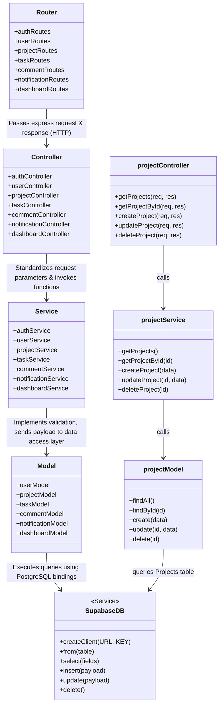

# Task Management System - Backend Class Diagram

Below is the class diagram representing the system's modular architecture (using standard MVC/Service-oriented layers) and call hierarchy (Routes $\rightarrow$ Controllers $\rightarrow$ Services $\rightarrow$ Models $\rightarrow$ Supabase Database).

## 1. Class Diagram (Mermaid)

---

## 2. Module Flow Details

1. **Routes (API Entry point):** Matches request paths (e.g. `GET /api/projects/:id`), executes middleware checks (such as `authenticate` and `allowRoles`), and delegates request context to the controller.
2. **Controllers (Request Handlers):** Parses parameters (`req.params`, `req.query`, `req.body`), passes data to the matching Service, and returns formatted responses (`successResponse` / `errorResponse`) to the client.
3. **Services (Business Logic Layer):** Executes business constraints (e.g. checking that a project name is not empty or password passwords meet length requirements) and coordinates model queries.
4. **Models (Data Access Layer):** Integrates the Supabase Client database bindings, communicating with the cloud PostgreSQL engine to insert, select, or modify rows.
